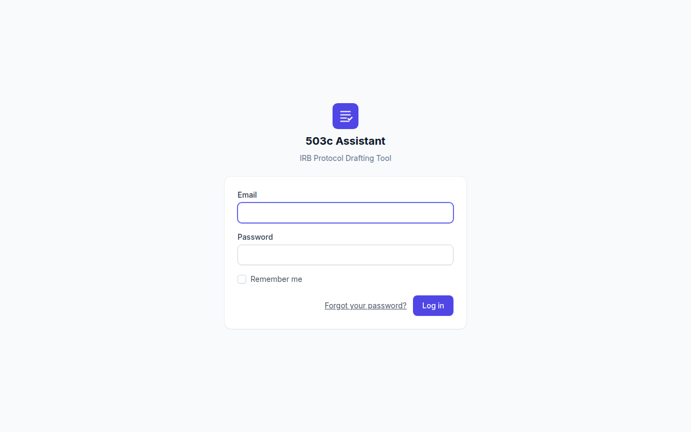
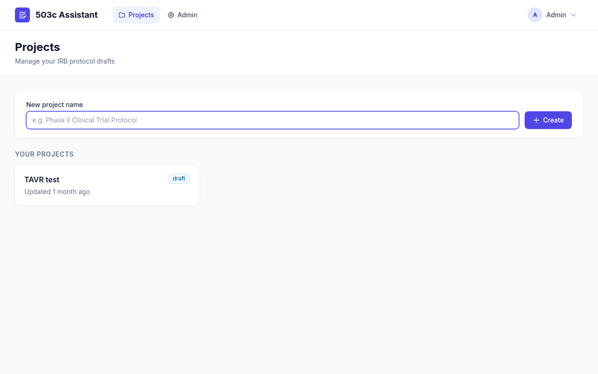
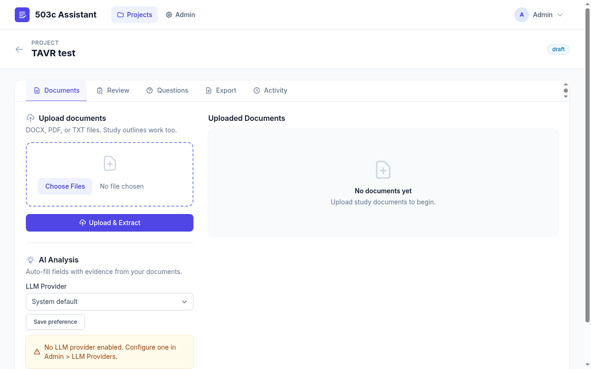
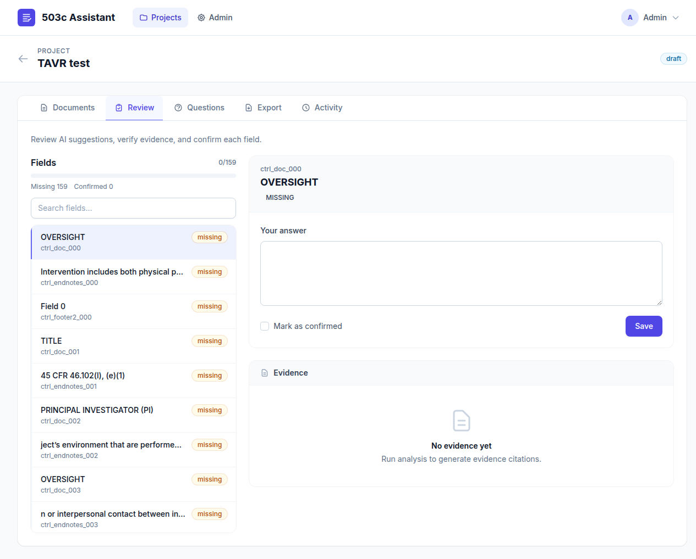
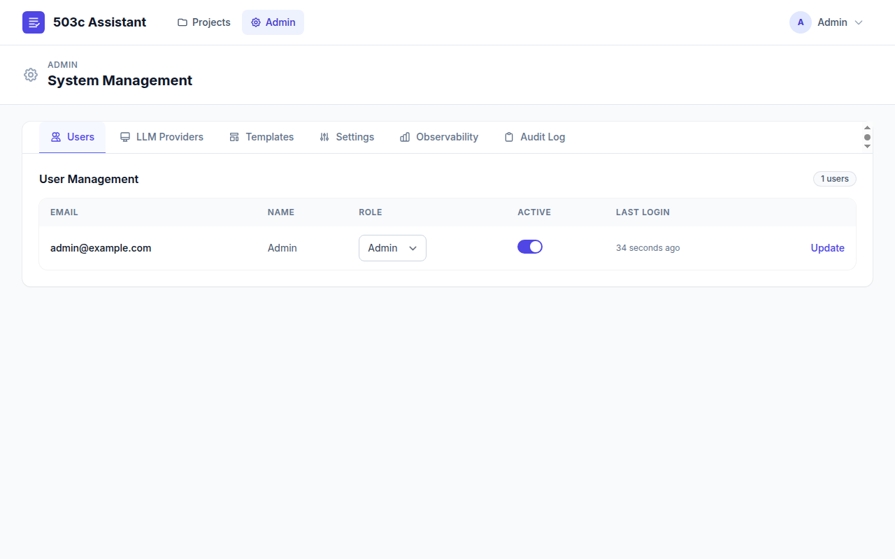

# IRB-Assistant

> [!CAUTION]
> **Under Active Development** -- This project is in early development and is **not ready for production use**. Features, APIs, and data schemas may change without notice. Use in development/testing environments only.

A local-first web application that helps researchers draft **HRP-503c** (Human Research Engagement Determination) IRB forms from uploaded study documents.

## How It Works

```
Upload Documents  -->  Extract & Chunk  -->  LLM Analysis  -->  Review & Edit  -->  Export .docx
   (DOCX/PDF/TXT)        (text + metadata)    (suggestions +     (accept/reject     (filled HRP-503c
                                                evidence)          per field)          template)
```

1. **Upload** your study documents (DOCX, PDF, or TXT)
2. **Automatic extraction** chunks the text with metadata for traceability
3. **LLM analysis** generates field suggestions backed by evidence quotes from your documents
4. **Review** each suggestion with side-by-side evidence browsing and deep-linking to source passages
5. **Export** a completed HRP-503c DOCX with your approved answers filled into the official template

### Login



### Projects Dashboard



### Project Detail -- Document Upload & AI Analysis



### Field Review with Evidence



### Admin Panel



## Key Features

- **Evidence-backed suggestions** -- every LLM suggestion includes traceable quotes from source documents with chunk-level provenance
- **Encryption at rest** -- uploaded files are encrypted using XChaCha20-Poly1305
- **Malware scanning** -- uploads are scanned via ClamAV before processing
- **Audit logging** -- all actions (uploads, edits, exports, admin changes) are recorded
- **Multi-provider LLM support** -- OpenAI, OpenAI-compatible, LM Studio, Ollama, and GLM 4.7
- **Template-driven export** -- fills Word content controls (SDTs) in the official HRP-503c template
- **Retention management** -- automated daily cleanup of expired documents and exports
- **Role-based access** -- admin/user roles with configurable registration

## Tech Stack

| Layer | Technology |
|-------|-----------|
| Backend | Laravel 12 / PHP 8.3 |
| Database | MySQL / MariaDB (user-space, no sudo) |
| Frontend | Blade + Tailwind CSS + Alpine.js |
| Build | Vite |
| Tests | PHPUnit (114 tests, 363 assertions) |

## Quick Start

### Prerequisites

- PHP 8.3+
- Node.js 18+
- MariaDB or MySQL (included user-space scripts for Linux/WSL2)

### Setup

```bash
cd 503c-assistant

# Start local database (user-space, no sudo required)
./ops/db/start.sh

# Configure environment
cp .env.example .env
php artisan key:generate

# Install dependencies
composer install
npm install

# Initialize database
php artisan migrate
php artisan db:seed

# Build frontend assets
npm run build

# Start development server
php artisan serve --host=127.0.0.1 --port=8000
```

Open http://localhost:8000

### Default Login

| Field | Value |
|-------|-------|
| Email | `admin@example.com` |
| Password | `change-me` |

To re-seed the admin user after changing credentials in `.env`:

```bash
php artisan db:seed --class=Database\\Seeders\\AdminUserSeeder
```

### Stop Database

```bash
cd 503c-assistant
./ops/db/stop.sh
```

## Project Structure

```
503c-assistant/
  app/
    Console/Commands/       # Artisan commands (retention prune, template dump)
    Http/Controllers/       # Request handlers (projects, admin, auth, export)
    Http/Middleware/         # Auth guards (EnsureUserIsAdmin, EnsureUserIsActive)
    Models/                 # 15 Eloquent models
    Services/               # Core business logic
      AuditService           - Action logging with request context
      DocumentExtractionService - DOCX/PDF/TXT text extraction + chunking
      DocxExportService      - Template-based DOCX generation via SDT filling
      FileEncryptionService  - XChaCha20-Poly1305 encryption at rest
      LlmChatService         - Multi-provider LLM gateway
      MalwareScanService     - ClamAV integration with quarantine
      ProjectAnalysisService - Evidence-based field suggestion pipeline
      ProjectPurgeService    - Safe project deletion with audit redaction
      SettingsService        - Key-value system settings with caching
      TemplateService        - Template upload, control scanning, mapping
    ViewModels/             # View data preparation
  database/
    migrations/             # 22 migration files
    seeders/                # Admin user, field definitions, template seeder
    factories/              # 7 model factories for testing
  resources/
    mapping-packs/          # Bundled HRP-503c field mappings (7 fields)
    templates/              # HRP-503c.docx official template
    views/                  # Blade templates (admin, auth, projects, components)
  ops/
    db/                     # User-space MariaDB start/stop/setup scripts
    apache/                 # Production Apache config samples
    cron/                   # Crontab example for retention
  tests/
    Feature/                # Integration tests (auth, projects, admin, E2E flow)
    Unit/                   # Unit tests (all services, view models)
```

## Configuration

### Environment Variables

| Variable | Default | Description |
|----------|---------|-------------|
| `IRB_ALLOW_REGISTRATION` | `false` | Enable public user registration |
| `IRB_PDF_PARSER_MEMORY_MB` | `256` | Memory limit for PDF fallback parser |
| `IRB_FILE_ENCRYPTION_KEYS` | -- | Encryption keys for file storage |
| `IRB_FILE_ENCRYPTION_ACTIVE_KEY_ID` | -- | Active encryption key identifier |

See `503c-assistant/.env.example` for the full list.

### LLM Providers

Configure LLM providers through the Admin panel. Supported types:

- **OpenAI** -- standard OpenAI API
- **OpenAI-compatible** -- any `/chat/completions` endpoint
- **LM Studio** -- local LM Studio instance
- **Ollama** -- local Ollama instance
- **GLM 4.7** -- GLM model endpoint

External LLM usage can be globally disabled via admin policy settings.

## Testing

```bash
cd 503c-assistant

# Run full test suite
php artisan test

# Run with coverage (requires Xdebug/PCOV)
php artisan test --coverage
```

## Retention & Cleanup

The app treats all uploads and exports as sensitive data. A retention prune command removes expired files:

```bash
# Preview what would be deleted
php artisan irb:retention-prune --dry-run

# Execute cleanup
php artisan irb:retention-prune

# Custom retention period
php artisan irb:retention-prune --days=7
```

Automated daily cleanup runs at 03:00 via Laravel's scheduler. Add this to your crontab:

```bash
* * * * * cd /path/to/503c-assistant && php artisan schedule:run >> /dev/null 2>&1
```

## Security

- Uploaded files stored outside web root with optional XChaCha20-Poly1305 encryption
- Malware scanning via ClamAV (best-effort, graceful fallback)
- Rate limiting on authentication routes (5 attempts per minute)
- Public registration disabled by default
- LLM request/response payloads stored as redacted JSON with encrypted full payload
- Audit trail for all admin, upload, analysis, and export actions
- Project deletion redacts audit payloads while preserving event records

See `503c-assistant/SECURITY_CHECKLIST.md` for the full security posture.

## Deployment

For production deployment guidance:

- `503c-assistant/ops/DEPLOYMENT_CHECKLIST.md` -- step-by-step deployment guide
- `503c-assistant/ops/apache/` -- Apache reverse proxy configuration samples
- `503c-assistant/ops/cron/` -- Crontab example for scheduler

## License

This project is proprietary. All rights reserved.
